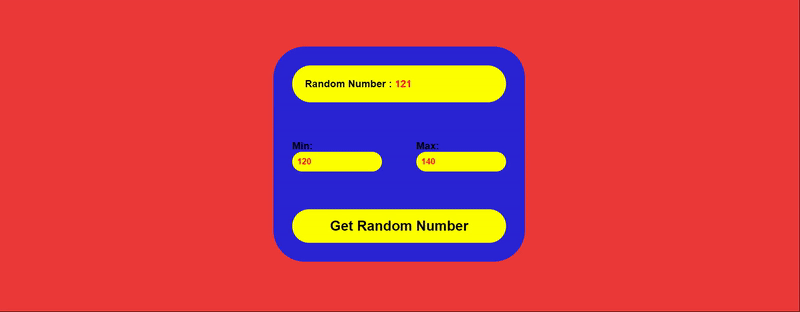

<h1>GET RANDOM NUMBER</h1>

    React'ın useState hook'unu kullanarak, bizim belirledigimiz iki sayi arasindan rastgele sayi goruntuleyen kucuk calismami sizlere sunuyorum.

<h2>Kullanilan Teknolojiler</h2>

    HTML CSS ve React ile kodlandi.

<h2>Ekran Goruntusu</h2>

